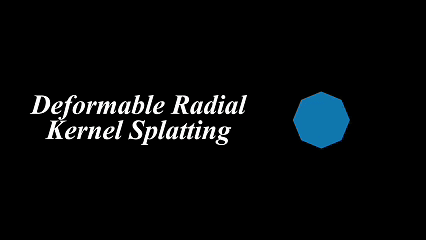
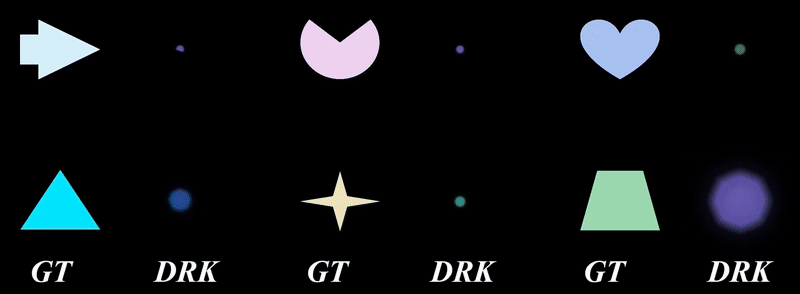

<h1 align="center">
  Deformable Radial Kernel Splatting

  
  
</h1>

This is the code for Deformable Radial Kernel Splatting.

  

DRK representation extends Gaussian kernels with learnable radial bases, enabling the modeling of diverse shape primitives. Additionally, parameters are introduced to control the sharpness and boundary curvature of these primitives. The following video showcase the effectiveness of each parameter.

  

DRK can flexibly fit various basic primitives with diverse shapes and sharp boundaries.

  

