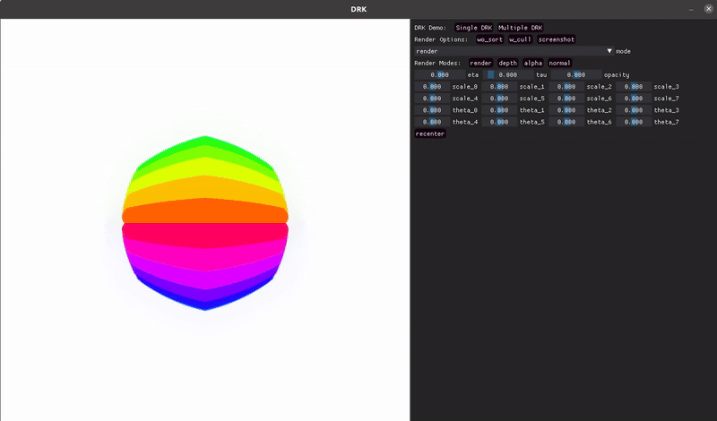

<h1 align="center">
  Deformable Radial Kernel Splatting

  <a href="https://www.hku.hk/"> </a>
  <a href="https://github.com/VAST-AI-Research/"> </a>
</h1>

This repository contains the code for **Deformable Radial Kernel Splatting (DRK)**.

<div align="center">
  
[](https://yihua7.github.io/DRK-web/)
[](https://arxiv.org/pdf/2412.11752)

</div>

**Deformable Radial Kernel (DRK)** extends Gaussian kernels with learnable radial bases, enabling the modeling of diverse shape primitives. It introduces parameters to control the sharpness and boundary curvature of these primitives. The following video showcases the effectiveness of each parameter:

<div align="center">
  
</div>

DRK can flexibly fit various basic primitives with diverse shapes and sharp boundaries:

<div align="center">
  
</div>

---

## Environment Setup

### Create and Activate Python Environment
#### Using Conda:
```bash
conda create -n drkenv python=3.9  # (Python >= 3.8)
conda activate drkenv
```

#### Using Virtualenv:
```bash
virtualenv drkenv -p python3.9  # (Python >= 3.8)
source drkenv/bin/activate
```

### Install Dependencies
```bash
pip install -r requirements.txt
cd submodules/depth-diff-gaussian-rasterization
python setup.py install && pip install .
cd ../drk_splatting
python setup.py install && pip install .
cd ../simple-knn
python setup.py install && pip install .
cd ../..
```

---

## UI Demo

We provide a UI demo to better understand the effects of DRK attributes and cache-sorting. To run the demo, execute the following script:

```bash
python drk_demo.py
```

The demo allows you to adjust attribute bars, switch rendering modes (normal, alpha, depth, RGB), toggle cache-sorting, and explore DRK's flexible representation capabilities.

<div align="center">
  
</div>

---

## Mesh2DRK

We also provide a script to convert mesh assets into DRK representation **without training**. To achieve mixed rendering of meshes and reconstructed scenes, specify the `scene_path` in [mesh2drk.py](./mesh2drk.py). If `scene_path` is left empty, the script will render the mesh only. You can modify the `mesh_path_list` to include any assets you wish to render. Currently, `.obj + .mtl` and `.ply` formats are supported. For reference, we provide example assets in the [meshes](./meshes) folder.

```bash
python mesh2drk.py
```

<div align="center">
  
</div>

---

## Data Download

Download the datasets using the following links:

- [MipNeRF-360](https://jonbarron.info/mipnerf360)
- [DiverseScenes](https://drive.google.com/file/d/1k1Eb_0K6Bo3VS33cpwOmqHLdlQJrGyQy/view?usp=sharing)

---

## Running the Code

### Commands
Run the following commands in your terminal:

#### Training:
```bash
CUDA_VISIBLE_DEVICES=${GPU} python train.py -s ${PATH_TO_DATA} -m ${LOG_PATH} --eval --gs_type DRK --kernel_density dense --cache_sort  # Optional: --gui --is_unbounded
```

#### Evaluation:
```bash
CUDA_VISIBLE_DEVICES=${GPU} python train.py -s ${PATH_TO_DATA} -m ${LOG_PATH} --eval --gs_type DRK --kernel_density dense --cache_sort --metric
```

### Command Options:
- `--kernel_density`: Specifies the primitive density (number) for reconstruction. Choose from `dense`, `middle`, or `sparse`.
- `--cache_sort`: (Optional) Use cache sorting to avoid popping artifacts and slightly increase PSNR (approx. +0.1dB). Ensure consistency between training and evaluation. Note: In specular scenes, disabling cache-sort may yield better results as highlights are better modeled without strict sorting.
- `--is_unbounded`: Use different hyperparameters for unbounded scenes (e.g., Mip360).
- `--gui`: Enables an interactive visualization UI. Toggle cache-sorting, tile-culling, and view different rendering modes (normal, depth, alpha) via the control panel.

### Batch Scripts
Scripts for evaluating all scenes in the dataset are provided in the [scripts](./scripts) folder. Modify the paths in the scripts before running them.

```bash
python ./scripts/diverse_script.py  # For DiverseScenes
python ./scripts/mip360_script.py   # For MipNeRF-360
```

---

## Citing

If you find our work useful, please consider citing:

```bibtex
@article{huang2024deformable,
  title={Deformable Radial Kernel Splatting},
  author={Huang, Yi-Hua and Lin, Ming-Xian and Sun, Yang-Tian and Yang, Ziyi and Lyu, Xiaoyang and Cao, Yan-Pei and Qi, Xiaojuan},
  journal={arXiv preprint arXiv:2412.11752},
  year={2024}
}
```